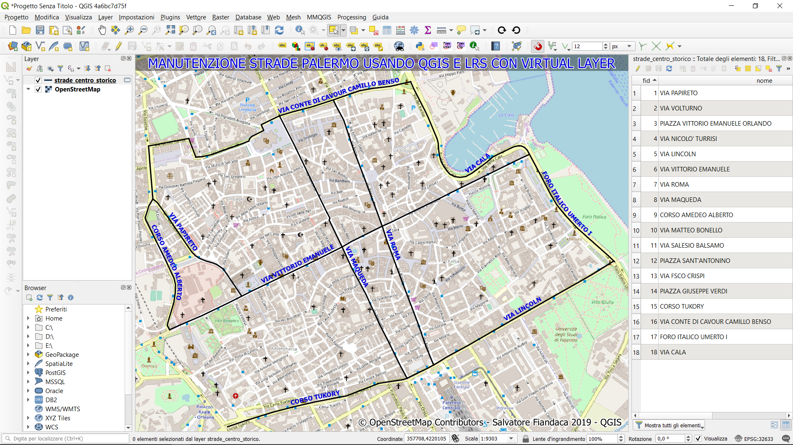
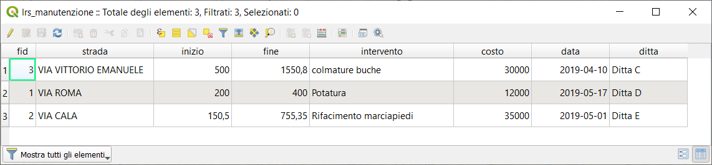
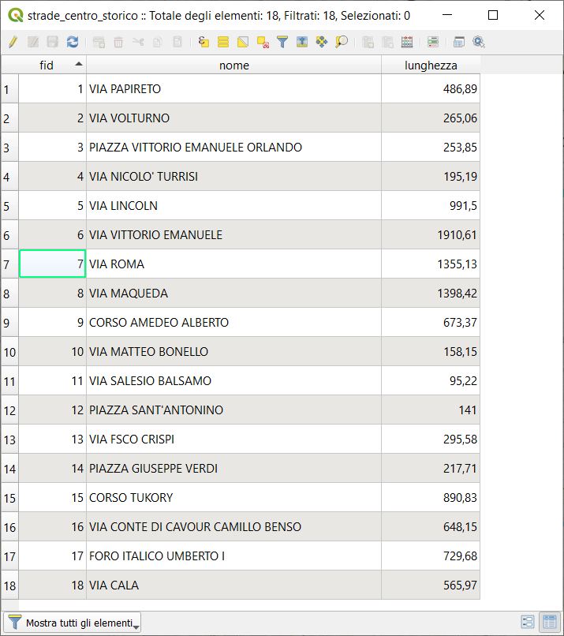
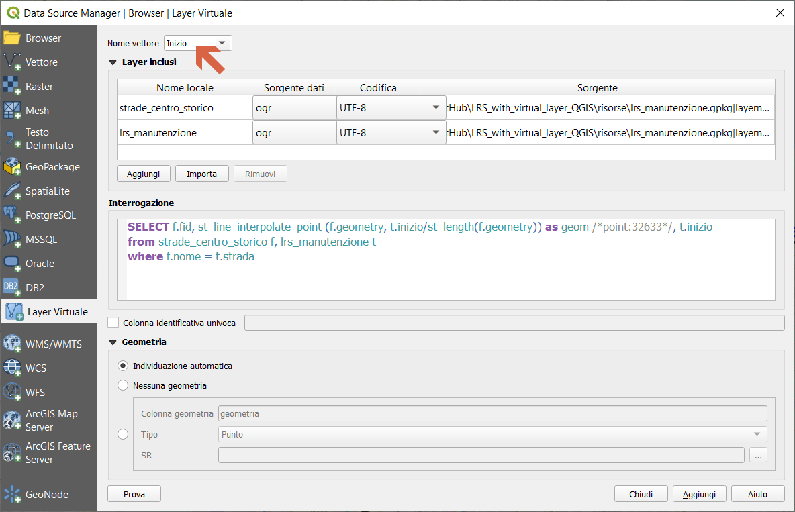
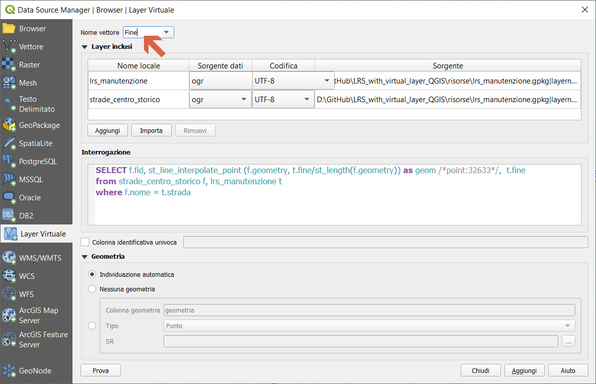
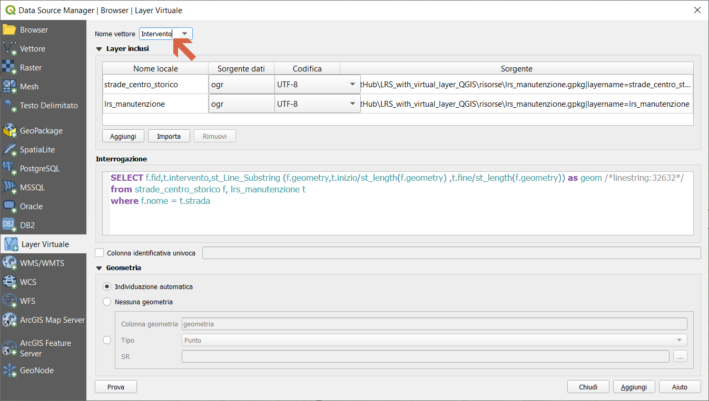
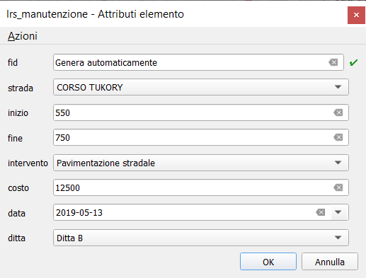
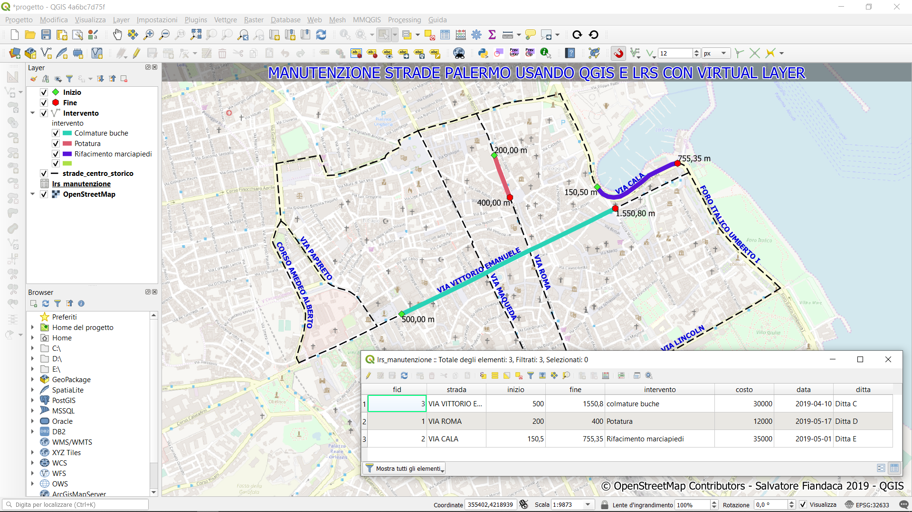

# LRS con virtual layer in QGIS

Linear Reference System (LRS) utilizzando i Virtual Layer di QGIS

## Che cosa è LRS

Il *riferimento lineare* (chiamato anche sistema di riferimento lineare o LRS ), è un metodo di riferimento spaziale in ingegneria e costruzione, in cui le posizioni delle caratteristiche fisiche lungo un elemento lineare sono descritte in termini di misure da un punto fisso, come una pietra miliare lungo una strada. Ogni funzione è localizzata da un punto (ad esempio un cartello) o da una linea (ad esempio una zona di divieto di passaggio). Se viene modificato un segmento dell'elemento lineare o della rotta, è necessario aggiornare solo le posizioni sul segmento modificato. [WikiPedia](https://en.wikipedia.org/wiki/Linear_referencing)

## LRS a cosa serve

Il riferimento lineare è adatto per la gestione di dati relativi a caratteristiche lineari come strade, ferrovie, oleodotti e gasdotti, linee elettriche e di trasmissione dati e fiumi. [WikiPedia](https://en.wikipedia.org/wiki/Linear_referencing)

## Esempio d'uso

Immagioniamo di dover gestire gli assi stradali principali del centro storico di Palermo e di tenere aggiornata la manutenzione usando QGIS.



### Dati

0. creo un **GeoPackage** con:

1. tabella manutenzione (alfanumerica) `lrs_manutenzione`



2. geo-tabella con gli assi stradali `strade_centro_storico`



### Virtual Layer

Un tipo speciale di vettore che consente di definire un layer come il risultato di un’interrogazione avanzata, utilizzando il linguaggio SQL su tutti i vettori che QGIS è in grado di aprire. Questi layer sono chiamati layer virtuali: non caricano dati propri e possono essere visti come una visualizzazione di altri layer. [Doc QGIS](https://docs.qgis.org/2.14/it/docs/user_manual/working_with_vector/virtual_layers.html)

ecco i tre Virtual Layer necessari per questo esempio:

1. Punto **Inizo**

```sql
SELECT f.fid, st_line_interpolate_point (f.geometry, t.inizio/st_length(f.geometry)) AS geom /*point:32633*/, t.inizio
FROM strade_centro_storico f, lrs_manutenzione t
WHERE f.nome = t.strada;
```



2. Punto **Fine**

```sql
SELECT f.fid, st_line_interpolate_point (f.geometry, t.fine/st_length(f.geometry)) AS geom /*point:32633*/,  t.fine
FROM strade_centro_storico f, lrs_manutenzione t
WHERE f.nome = t.strada;
```



1. Linea **intervento**

```sql
SELECT f.fid,t.intervento,st_Line_Substring (f.geometry,t.inizio/st_length(f.geometry) ,t.fine/st_length(f.geometry)) AS geom /*linestring:32632*/
FROM strade_centro_storico f, lrs_manutenzione t
WHERE f.nome = t.strada;
```



### Maschera inserimento dati



### Risultato



### Prova tu

GeoPackage e Progetto QGIS -> scarica [qui](https://github.com/pigreco/LRS_with_virtual_layer_QGIS/raw/master/risorse/risorse.zip)

### Riferimenti

- [QGIS](https://qgis.org/it/site/)
- [Virtual Layer](https://docs.qgis.org/2.14/it/docs/user_manual/working_with_vector/virtual_layers.html)
- [Funzioni SpatiaLite](http://www.gaia-gis.it/gaia-sins/spatialite-sql-4.2.0.html)